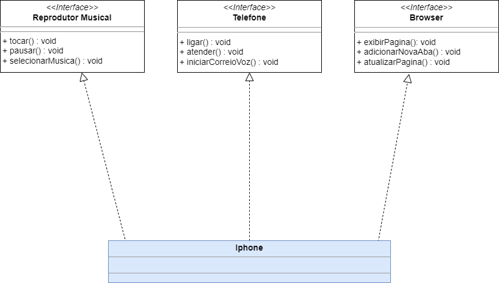

# Desafio DIO

<h3>Diagramação de classes do iPhone</h3>
 

Minha resposta do desafio com a diagramação e os arquivos .java representado a interação do Iphone com as interfaces de reprodução musical,telefone e browser.
 

